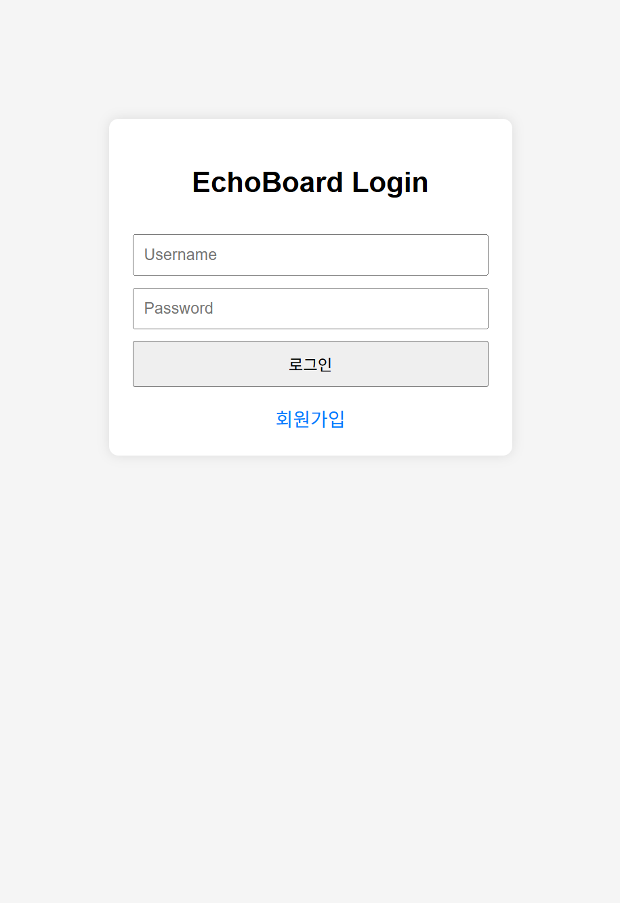
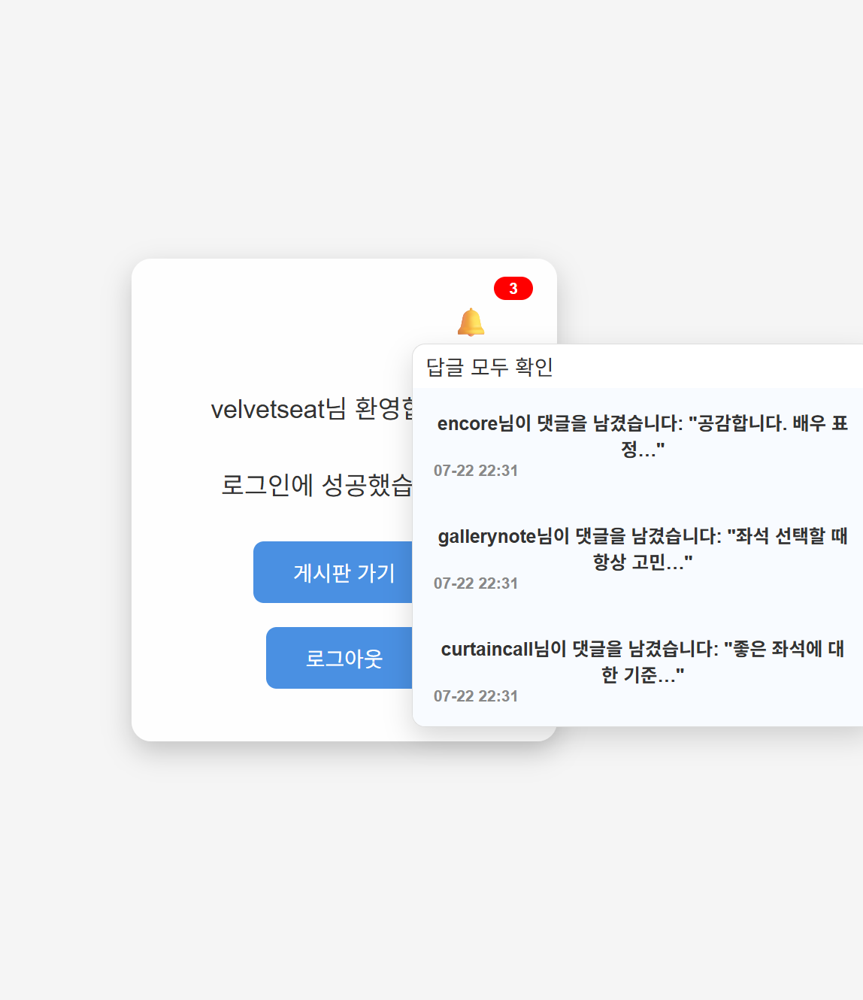
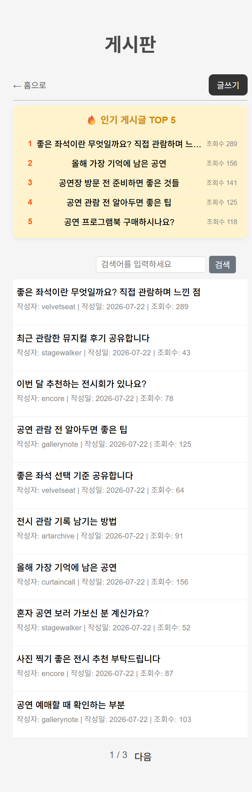
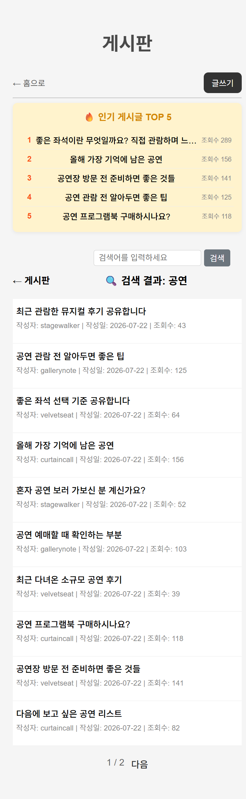
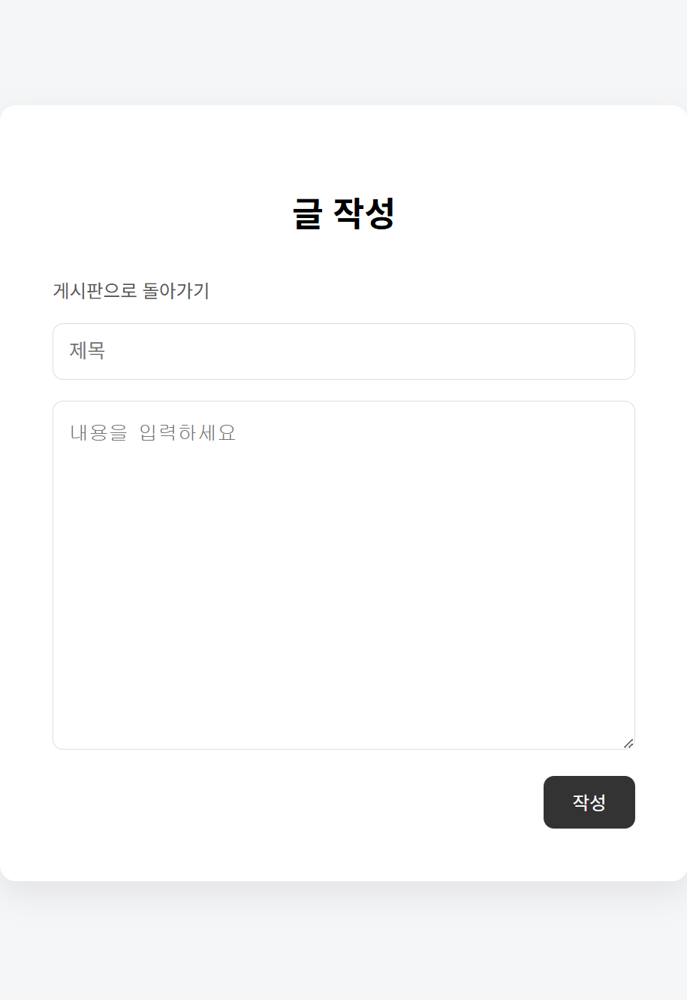

# EchoBoard
Spring Boot 기반의 커뮤니티 게시판 서비스입니다.

사용자가 게시글을 작성하고, 댓글을 통해 다른 사용자와 소통할 수 있는 서비스 구현을 목표로 진행했습니다.
회원 인증, 게시글 검색, 댓글 알림 등 사용자 경험을 고려한 기능을 구현했습니다.
Spring Boot 기반의 백엔드 구조와 데이터 관리를 경험하는 것을 목표로 개발했습니다.
## ✨ Main Features

### 회원 기능
- 회원가입
- 로그인 / 로그아웃
- Session 기반 인증 처리
### 게시글 기능
- 게시글 작성
- 게시물 목록조회
- 게시글 검색
- 인기 게시글 집계 및 인기 게시판 제공
### 댓글 기능
- 게시글 댓글 작성
- 댓글 기반 사용자 간 상호작용 구현
### 알림 기능
- 다른 사용자의 댓글 작성 시 알림 생성
### Redis 기반 실시간 데이터 처리
- Redis를 활용하여 게시글 조회수 증가 이벤트 처리 
- 조회수 데이터를 기반으로 인기 게시글 순위 산정
- ZSET 자료구조를 활용한 인기 게시글 캐싱 구현

## 📷 Screenshots
### 로그인페이지

### 홈화면과알림

### 메인페이지

### 검색

### 게시물작성

### 게시물예시

## Tech Stack

### Backend
- Java
- Spring Boot
- Spring MVC
- Spring Data JPA
- Spring Security (Session 기반 인증
### Database
- MariaDB
### Cache / Data Store
- Redis
###  emplate Engine
- Thymeleaf
### Build Tool
- Gradle

EVN)
JDK 21
springFramrok 3.2.0
gradle 8.3

마리아DB 12.1.2
docker 29.2
redis 7
