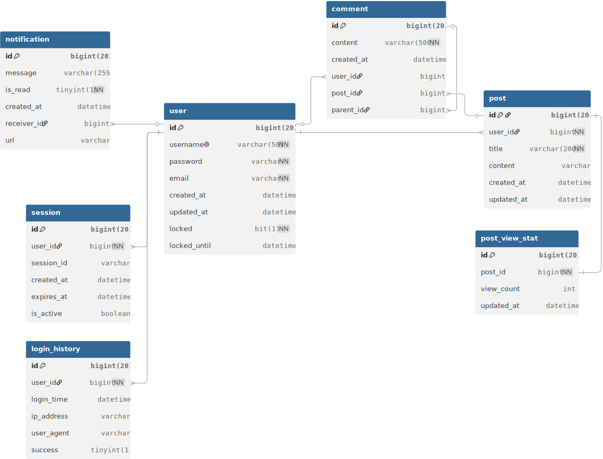

서비스 데이터베이스 구조입니다. 

## Entity정보및 설명

### user
- 회원 정보 및 인증정보를 관리합니다
- 로그인 실패횟수와 계정 잠금 상태를 관리합니다
### session
- 세션기반 인증을 위한 로그인상태 정보를 관리합니다
### login_history
- 로그인 시도기록을 기록합니다
- 접속IP, User-Agent,성공 여부를 기록합니다
### post
- 게시물 정보를 가지고있습니다
- 댓글,조회수 통계와 연계됩니다
### post_view_stat
- 게시글 조회수를 별도관리합니다
- redis로 조회수 갱신을 처리합니다
### comment
- 게시물 댓글을 가지고있습니다
- 'parent_id'을 통한 자기참조 관계로 대댓글 구조를 지원합니다
### notification
- 사용자별 알림정보를 관리합니다
- 읽음여부('is_read')와 이동경로('url')를 저장합니다

